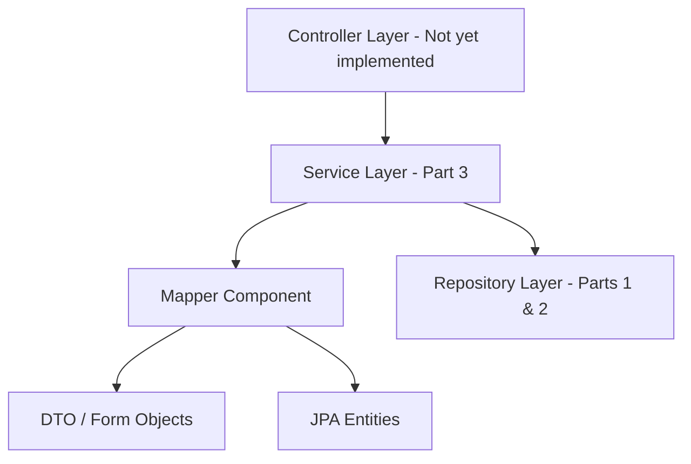
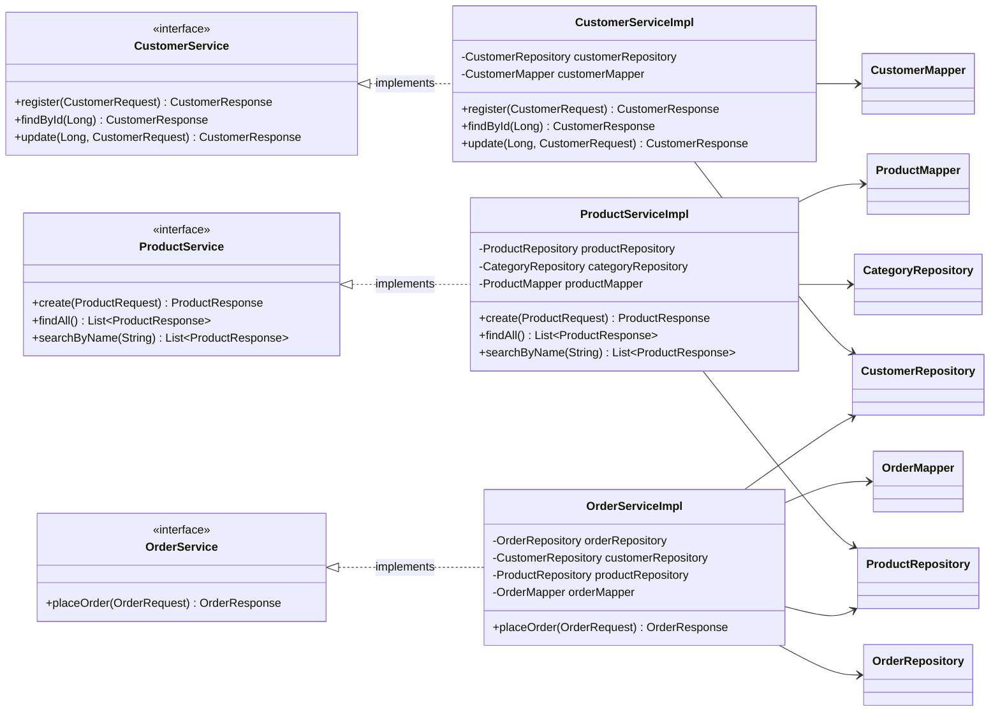
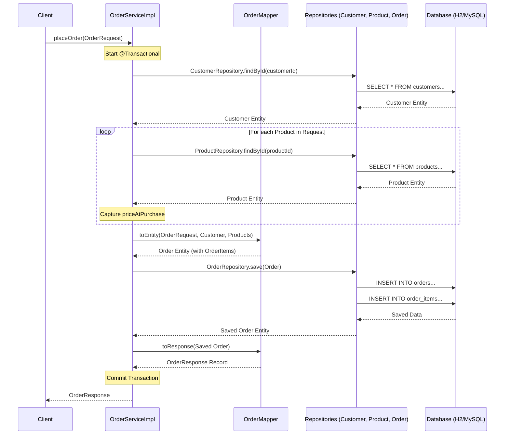

# Workshop: E-commerce Platform JPA (Part 3)

## Objective

Evolve the system by implementing a robust **Service Layer**, introducing **Data Transfer Objects (DTOs)**, and utilizing **Mappers** to decouple the persistence layer from the presentation layer.

## Project Setup & Verification

This section continues from **Part 2**. Before implementing the service layer:

1. **Create a new branch for Part 3**
2. **Review Dependencies**: Ensure `spring-boot-starter-validation` is in `pom.xml` for DTO validation.
3. **Optional**: Add `MapStruct` dependency if you want to explore automated mapping (though manual mappers are recommended for learning).

---

## Architectural Overview: Layered Architecture

In Part 3, we move away from using Entities in our repositories directly. We introduce a layer that handles business rules and data transformation.

---

## Service Layer: Class Diagram

The following diagram illustrates the **Interface/Implementation** pattern used for our services, showing how they interact with Repositories and Mappers.

---

## Data Transfer Objects (DTO)

Define immutable Data Transfer Objects (DTOs) using Java Records to securely and efficiently move data between the different layers of your application.

Create a package `se.lexicon.ecommerceworkshop.dto`. In this part, we use **Java Records** for our DTOs. 
Records are immutable, provide a concise syntax, and are perfect for data transfer.

### 1. Customer DTOs
- **CustomerResponse**: For outgoing data (includes `id`, `fullName`, `email`, `addressResponse`).
- **CustomerRequest**: For incoming data (includes `firstName`, `lastName`, `email`, `password`, `street`, `city`, `zipCode`).
    - **Requirement**: Use validation annotations like `@NotBlank`, `@Email`, and `@Size(min=...)` to ensure data integrity.

### 2. Product & Category DTOs
- **ProductResponse**: Flattened view of a product, including `categoryName`.
- **ProductRequest**: For creating/updating products, including `name`, `price`, and `categoryId`.
- **CategoryResponse**: Basic name and ID.

### 3. Order DTOs
- **OrderResponse**: Contains order details, status, and a list of `OrderItemResponse`.
- **OrderRequest**: Used to place an order, containing `customerId` and a list of items (`productId` + `quantity`).
    - **Requirement**: Use `@NotEmpty` for the list of items and `@Min(1)` for quantities.

---

## Task 1: Mapper Layer

Create dedicated mapper components to handle the transformation between JPA entities and DTOs, ensuring a clean separation between your persistence and presentation layers.

Create a package `se.lexicon.ecommerceworkshop.mapper`. Implement these as Spring `@Component` classes.

### 1. Mapper Requirements
- **Task**: Create `CustomerMapper`, `ProductMapper`, and `OrderMapper`.
- **Methods**:
    - `toResponse(Entity entity)`: Converts a database entity to a Response Record.
    - `toEntity(Request request)`: Converts a Request Record back to a JPA Entity.
- **Logic**: Since we are using **Records**, you must use the canonical constructor for mapping (no setters).

---

## Task 2: Service Layer Requirements

Implement the service layer to encapsulate business logic, coordinate repository operations, and provide a clean API for the controller layer.

Create a package `se.lexicon.ecommerceworkshop.service`. Use the **Interface/Implementation** pattern (`Service` + `ServiceImpl`).

### 1. CustomerService (Management)
- **Required Methods**:
    - `register(CustomerRequest request)`: Create a new customer. Check if the email is already taken.
    - `findById(Long id)`: Return `CustomerResponse` or throw `ResourceNotFoundException`.
    - `update(Long id, CustomerRequest request)`: Update details.

### 2. ProductService (Catalog)
- **Required Methods**:
    - `create(ProductRequest request)`: Validate the category exists before saving.
    - `findAll()`: Return `List<ProductResponse>`.
    - `searchByName(String name)`: Return filtered results.

### 3. OrderService (Business Process)
- **Task**: The most complex service, coordinating multiple repositories.
- **Required Method**: `placeOrder(OrderRequest request)`.
- **Business Logic**:
    1. Find the `Customer`.
    2. For each requested item, find the `Product`.
    3. Capture the **current price** of the product as `priceAtPurchase`.
    4. Apply any active **Promotions** (optional).
    5. Save the `Order` with its items.
- **Requirement**: Mark the method as **`@Transactional`** to ensure all-or-nothing persistence.

---

## Task 3: Transaction Management & Rollbacks

Apply transaction management to ensure data integrity and atomicity for complex business operations, such as placing an order.

---

## Task 4: Custom Exception Handling

Define custom exceptions to represent specific business errors, allowing for more precise and descriptive error reporting throughout the application.

---

## Optional: Advanced Services

For those who want to go further, implement these additional services to complete the catalog and promotion logic.

### 1. CategoryService (Catalog Management)
- **Goal**: Manage product categories independently.
- **Methods**:
    - `create(String name)`: Create a new category after checking if it already exists.
    - `findAll()`: Return `List<CategoryResponse>`.
- **Learning Focus**: Basic service logic and checking for duplicates.

### 2. PromotionService (Marketing Logic)
- **Goal**: Handle the logic for applying discounts.
- **Methods**:
    - `getActivePromotions()`: Return a list of currently active promotions.
    - `calculateDiscount(Product product)`: (Internal or Public) logic to find the best active promotion for a given product.
- **Learning Focus**: Implementing specialized business rules that don't directly correspond to simple CRUD.

---

## Example:

The sequence diagram shows the complete process of placing an order in the system.
It explains how the OrderService manages the workflow by communicating with Mappers, Repositories, and the Database, while ensuring everything happens inside a single transaction.

--- 

### Learning Goals
- **Decoupling**: Understand why the API shouldn't know about `@Entity` annotations or database relationships.
- **Data Integrity**: Using `@Transactional` to handle multi-step business processes.
- **Validation**: Moving validation from "Database Constraint" level to "Application" level using DTOs.
- **Clean Code**: Keeping business logic out of the Entity and Repository layers.

---

## Submission Checklist

- [ ] **Git Branch**: Create a feature branch for Part 3 (e.g., `feature/service-layer`).
- [ ] **DTOs & Records**: Implement the required Java Records for Requests and Responses, including validation.
- [ ] **Mappers**: Create the required mappers as Spring components.
- [ ] **Services**: Implement the required services using the Interface/Implementation pattern.
- [ ] **Transactions**: Ensure that business-critical methods are transactional to handle rollbacks on failure.
- [ ] **Exceptions**: Create and use custom exceptions for error handling.
- [ ] **Verification**: Run the application and verify that all service methods work as expected.
- [ ] **Commits**: Make descriptive commits for each major step.
- [ ] **Push**: Push the branch to GitHub and provide the link.

---