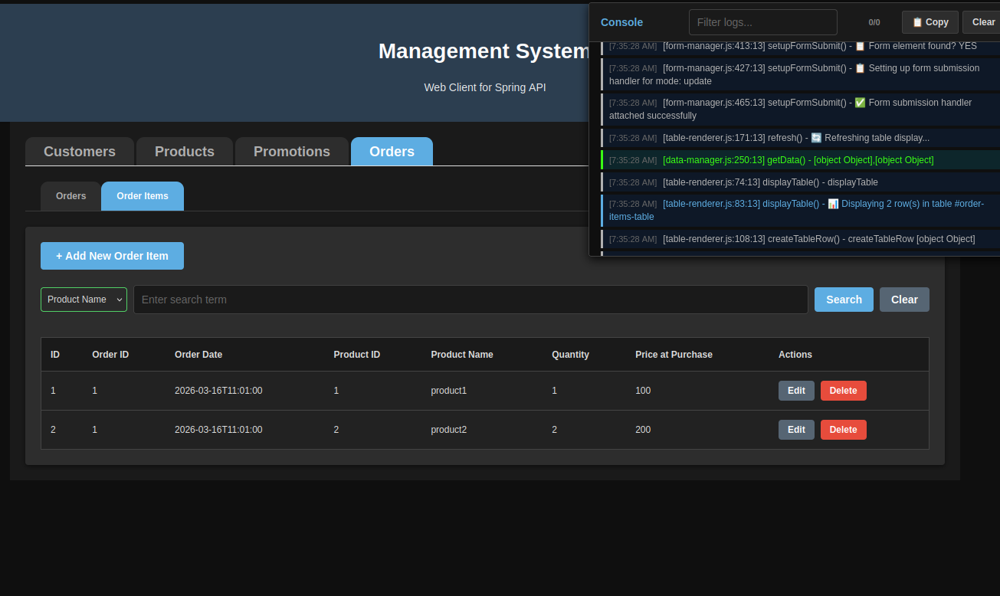
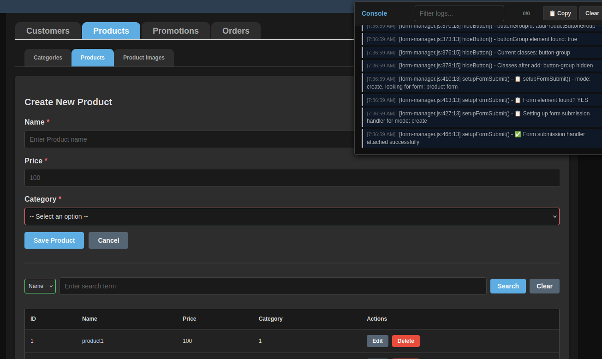
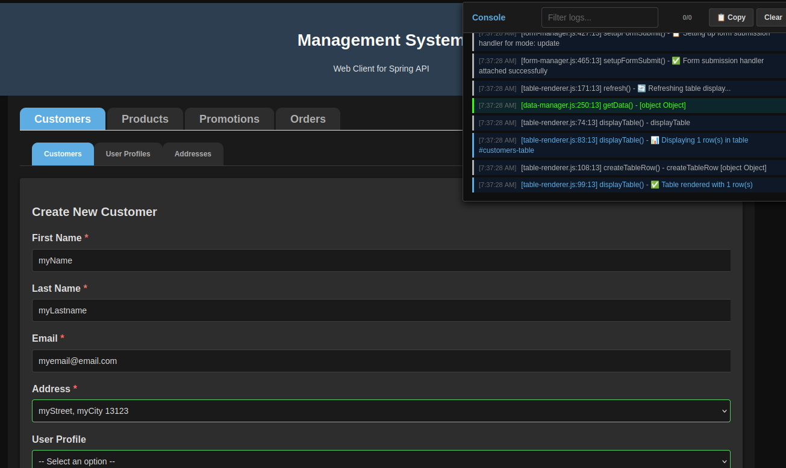
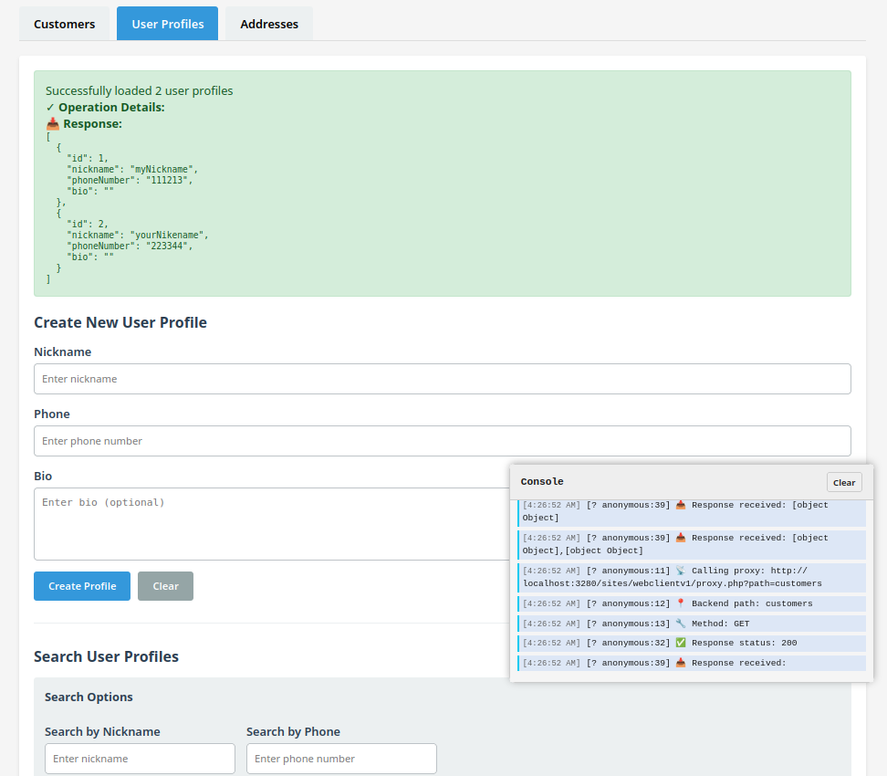
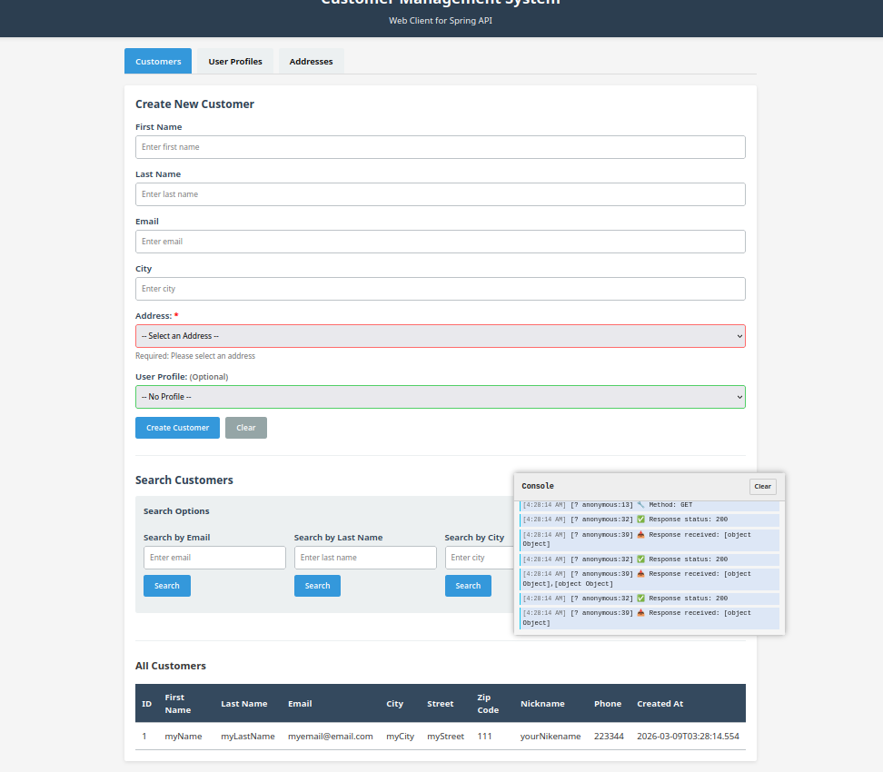
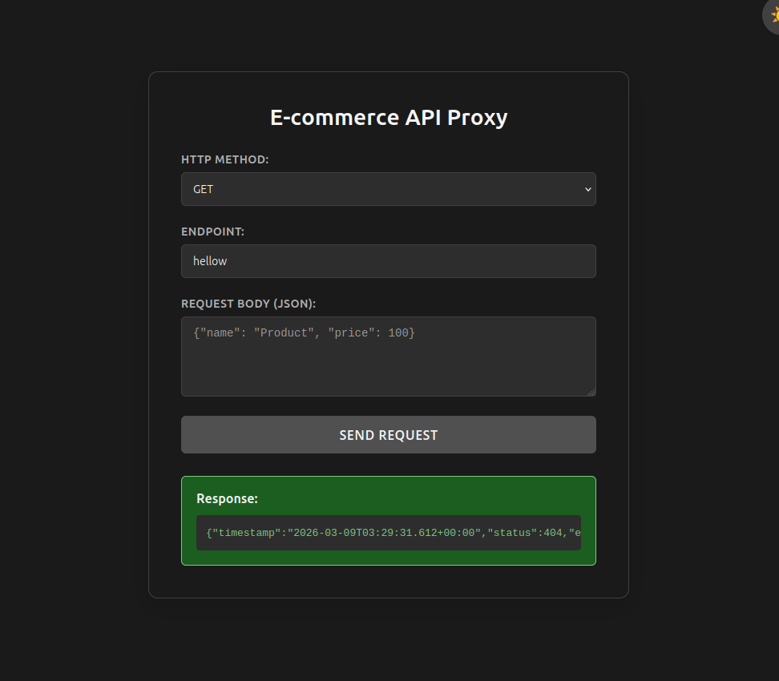
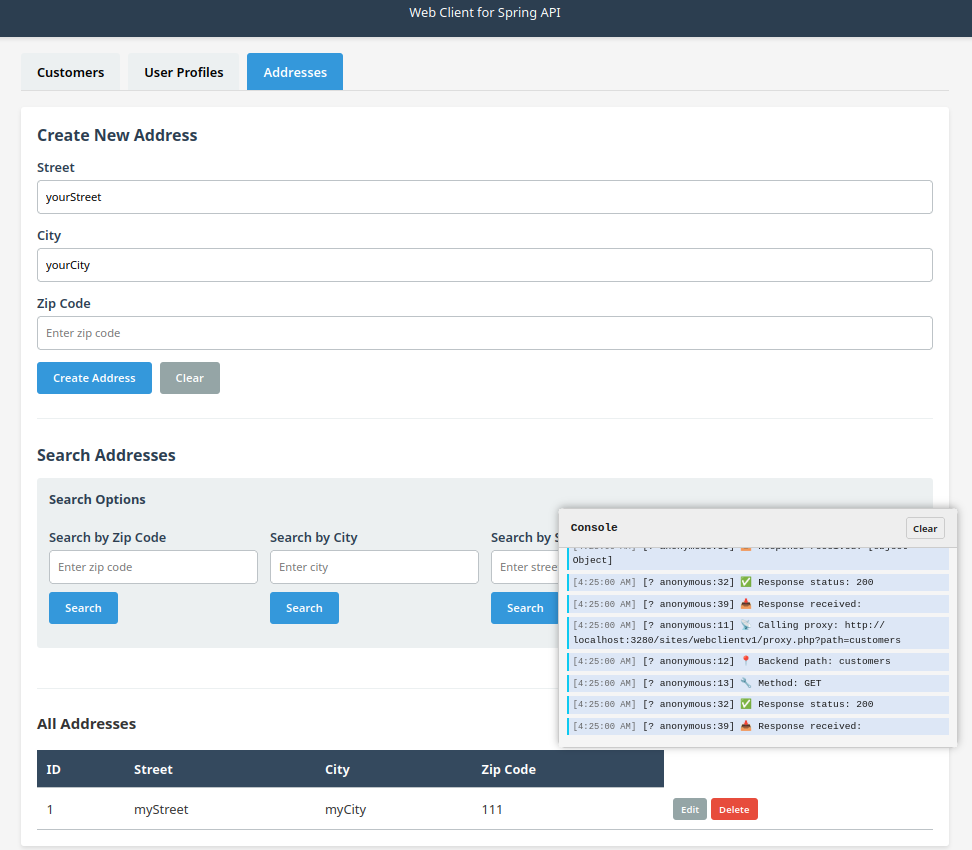

# E-Commerce - Workshop

## webClient 2 - Refactoring Plan for CRUDManager Class
 
### Current State Analysis

**Current Class Size:** ~800+ lines with **40+ methods** handling 6 distinct responsibilities.

**Main Problems:**
- **Single Responsibility Principle violated** - one class doing too much
- **Hard to test** - tightly coupled concerns
- **Difficult to maintain** - changes in one area affect others
- **Code reuse limited** - can't use form generation without CRUD operations
- **Readability poor** - have to scroll through 800 lines to find related methods

---

### Proposed Architecture: 5 Specialized Classes

| **Class Name** | **Responsibility** | **Methods** | **Purpose** |
|---|---|---|---|
| **DataManager** | API communication & data caching | loadAll, loadById, createEntity, updateEntity, deleteEntity, data property | Handle all backend communication |
| **TableRenderer** | HTML table generation & display | displayTable, createTableRow, generateTableHeaders, initializeTable | Render and manage table UI |
| **FormBuilder** | Form HTML generation from config | generateFormIfNeeded, buildFormHTML, buildFormFieldHTML, buildInputField, buildTextareaField, buildSelectField, buildCheckboxField, buildRadioField, buildDateTimeField, buildFormButtonsHTML | Dynamically create form elements |
| **FormManager** | Form interaction & submission | populateForm, validateFormData, prepareEntityData, getFormData, resetForm, setupFormSubmit, editEntity, showForm, hideForm, toggleFormVisibility | Handle form logic & submission |
| **SearchFilter** | Search & filtering operations | generateFilterUI, performSearch, filterData, clearFilter | Client-side search functionality |
| **UIController** | User feedback & loading states | showLoading, hideLoading, showMessage, handleError, escapeHtml | Handle all UI feedback |
| **UtilityHelper** | String transformations & helpers | kebabToCamel, capitalize, capitalizeFirstLetter, getNestedValue | Reusable utility functions |
| **CRUDManager** | Orchestrator (refactored) | Constructor, initialization, coordinate between classes | Tie everything together |

---

### Detailed Breakdown

#### **1. UtilityHelper Class**
**Purpose:** Reusable utility functions (no dependencies)

```
Methods:
- kebabToCamel(str)
- capitalize(str)
- capitalizeFirstLetter(str)
- getNestedValue(obj, path)
```

---

#### **2. UIController Class**
**Purpose:** All user-facing feedback and loading indicators

```
Methods:
- showLoading()
- hideLoading()
- showMessage(message, type, details)
- handleError(operation, error, context)
- escapeHtml(text)

Dependencies: UtilityHelper
```

---

#### **3. DataManager Class**
**Purpose:** All API communication and data caching

```
Methods:
- loadAll()
- loadById(id)
- createEntity(formData)
- updateEntity(id, formData)
- deleteEntity(id)
- (internal) buildApiMethodName(operation, entityName)

Properties:
- data (cached data)
- currentEditingId

Dependencies: UtilityHelper, UIController, apiClient
```

---

#### **4. TableRenderer Class**
**Purpose:** HTML table generation and display

```
Methods:
- initializeTable()
- generateTableHeaders()
- displayTable(data)
- createTableRow(entity)
- (internal) buildActionButtons(entityId)

Dependencies: UtilityHelper, config
```

---

#### **5. FormBuilder Class**
**Purpose:** Dynamically generate form HTML from config

```
Methods:
- generateFormIfNeeded()
- buildFormHTML(formId)
- buildFormFieldHTML(field)
- buildInputField(field)
- buildTextareaField(field)
- buildSelectField(field)
- buildCheckboxField(field)
- buildRadioField(field)
- buildDateTimeField(field)
- buildFormButtonsHTML()

Dependencies: UtilityHelper, UIController
```

---

#### **6. FormManager Class**
**Purpose:** Form interaction, validation, and submission

```
Methods:
- populateForm(entity)
- validateFormData(formData)
- prepareEntityData(formData, operation)
- getFormData()
- resetForm()
- setupFormSubmit(mode)
- showForm()
- hideForm()
- toggleFormVisibility(show)
- editEntity(id)

Dependencies: UtilityHelper, UIController, DataManager
```

---

#### **7. SearchFilter Class**
**Purpose:** Client-side search and filtering

```
Methods:
- generateFilterUI()
- performSearch()
- filterData(data, field, term)
- clearFilter()

Dependencies: UtilityHelper, UIController
```

---

#### **8. CRUDManager Class (Refactored)**
**Purpose:** Orchestrator - coordinates all components

```
Constructor:
- Initialize all helper classes
- Store config and apiClient

Methods:
- (public) initializeTable()
- (public) loadAll()
- (public) editEntity(id)
- (public) createEntity(formData)
- (public) updateEntity(id, formData)
- (public) deleteEntity(id)
- (public) showForm()
- (public) hideForm()
- (public) toggleFormVisibility(show)
- (public) performSearch()

Properties:
- tableRenderer
- formBuilder
- formManager
- searchFilter
- dataManager
- uiController
```

---

### Benefits of This Refactoring

✅ **Single Responsibility** - Each class has one clear job  
✅ **Testability** - Can test each class independently  
✅ **Reusability** - Use FormBuilder without DataManager, for example  
✅ **Maintainability** - Find related code in one place  
✅ **Scalability** - Easy to add new features (e.g., export, bulk operations)  
✅ **Readability** - Each file is 100-150 lines instead of 800+  

---

### Implementation Order

1. **UtilityHelper** (no dependencies - start here)
2. **UIController** (depends on UtilityHelper)
3. **FormBuilder** (depends on UtilityHelper, UIController)
4. **TableRenderer** (depends on UtilityHelper)
5. **SearchFilter** (depends on UtilityHelper, UIController)
6. **DataManager** (depends on UtilityHelper, UIController, apiClient)
7. **FormManager** (depends on UtilityHelper, UIController, DataManager)
8. **CRUDManager** (orchestrates all classes)

---

### Questions Before We Code

1. **Should we keep all classes in one file or separate files?** (I recommend separate files for better organization)
2. **Do you want to keep backward compatibility** with the current `window.crudManager` global?
3. **Any specific naming conventions** you prefer for the class files?
4. **Should we add TypeScript JSDoc comments** for better IDE support?

Would you like me to start coding the classes now, beginning with **UtilityHelper**?

this.utilityHelper 
this.uiController
this.dataManager
this.tableRenderer
this.formBuilder
this.searchFilter
this.formManager

toggleFormVisibility
initializeTable(

generateFormIfNeeded
loadAll
setupFormSubmit

## ScreenShots

### webClient v2





### webClient v1




### Resttester v1



